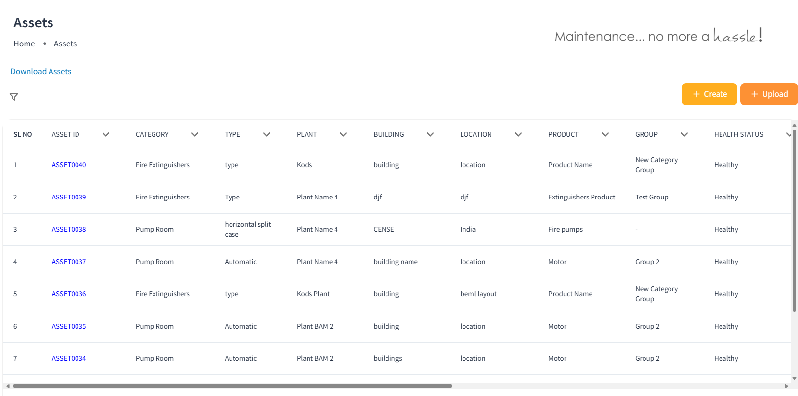

# Firedek - Fire Extinguisher and Pump Room Management Software

Firedek is a robust and scalable software solution designed to simplify the management of fire extinguishers and pump rooms across multiple facilities. Built using **React**, **Node.js**, **Express.js**, **MongoDB**, and **Firebase**, Firedek ensures efficient workflows, real-time notifications, and secure user authentication. The system includes multiple panels catering to admins, customers, and technicians, making it a comprehensive solution for fire safety management.

---

## Key Features

### Admin Panel
- **Complete Asset Management**:
  - View and manage fire extinguishers and pump rooms installed at customer sites.
  - Track service schedules with a **calendar view** for:
    - Upcoming services
    - Completed services
    - Pending services
- **Ticket Management**:
  - Monitor tickets raised by customers, including their status and assigned technicians.
- **Technician Assignment**:
  - Assign technicians to specific services.
- **Product and Customer Management**:
  - Add and manage products, customers, and service frequency.
- **Interactive Dashboard**:
  - Gain insights through metrics and charts for assets, services, and customer activities.
- **Advanced Reporting**: 
  -  Downloadable reports of completed services.

### Customer Panel
- **Asset Overview**:
  - Manage and track the status of installed products.
  - Get a detailed view of servicing schedules and asset health.
- **Facility Management**:
  - Organize assets across multiple plants and locations.
- **Service Requests**:
  - Raise tickets and monitor their resolution status.

### Technician Mobile App (Flutter)
- **Service Calendar**:
  - Access a calendar view of assigned services with detailed schedules.
- **Location-Based Services**:
  - Get real-time location details for assigned tasks.
- **Notifications**:
  - Receive push notifications for new assignments and maintenance reminders.
- **Service Scanner**:
  - Use the integrated scanner to start services directly by scanning the product.
- **Service Logs**:
  - Update and submit service details in real time.

---

## Technologies Used
- **Frontend**: React.js, MUI (Web Application)
- **Backend**: Node.js, Express.js
- **Database**: MongoDB
- **Mobile App**: Flutter
- **Push Notifications**: Firebase
- **Authentication**: OTP-based login
- **Schedulers**: Cron jobs for automated notifications and reminders

---

## My Role
As the **Backend Developer**, I have:
- Designed and implemented the web application backend.
- Built APIs to support mobile application functionalities.
- Integrated Firebase for push notifications and OTP-based login.
- Developed cron jobs to automate reminders and notifications.

---
## Screenshots

## Future Enhancements
- **Live Service Tracking**: Enable real-time tracking of technician movements during service.
- **AI Insights**: Predict maintenance needs based on historical data.
- **IOT Integration**: Get the real time data of the assets through IOT integration.
